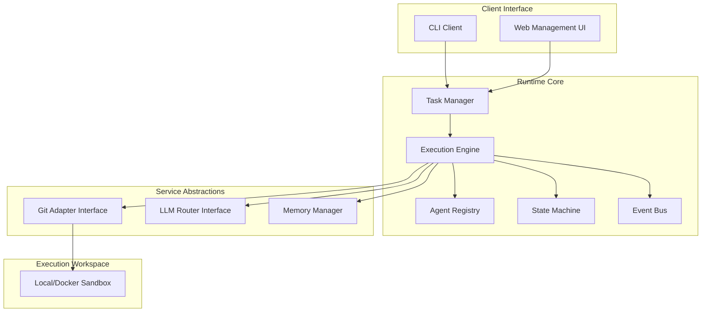
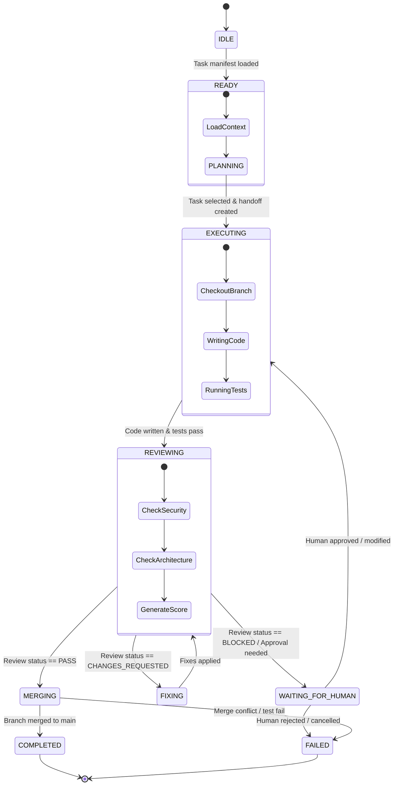
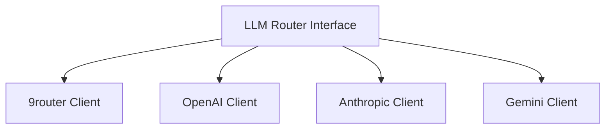

# Agentic Runtime Engine Architecture Specification (v1.0)

This document defines the architecture, components, state machines, and integrations for the **Agentic Runtime Engine**, a generic, event-driven orchestration system designed to coordinate autonomous AI agents (such as Planners, Executors, Reviewers, and Fixers) through multi-agent workflows.

---

## 1. High-Level Architecture

The Agentic Runtime Engine manages task scheduling, state transitions, memory scopes, and provider abstractions while keeping specific coding logic encapsulated inside autonomous agent units.



---

## 2. Runtime Responsibilities

The runtime engine provides the infrastructure to coordinate agents cleanly across the workspace, handling:

-   **Orchestration & State Management**: Runs agent execution, transitions statuses, and ensures execution is stateless at the individual agent level.
-   **Task Scheduling & Queue Management**: Manages execution ordering, task dependencies, priority queuing, and backoff retries.
-   **Context Loading & Token Optimization**: Reads necessary files, limits workspace files scope size, and filters out noise inputs before handing context to agents.
-   **Observability & Audit Trail**: Tracks completion timelines, token count metrics, LLM transaction cost budgets, and logs agent actions.
-   **Failure Recovery**: Manages crash recovery, checkpointing, and branch rollback operations.

---

## 3. Runtime Components

| Component | Responsibility | Dependencies | Inputs | Outputs |
| :--- | :--- | :--- | :--- | :--- |
| **Task Manager** | Parses tasks manifests, verifies dependency hierarchies. | Context Loader | `tasks-v1.md` | Executable Task Queue |
| **Execution Engine** | Coordinates agent invocation and schedules workloads. | Agent Registry, SM | Task ID | Execution Result |
| **Agent Registry** | Resolves versioning and verifies schemas of agents. | None | Agent Name / ID | Agent Blueprint |
| **State Machine** | Enforces valid status transitions. | Event Bus | Target Transition Event | New State Status |
| **Memory Manager** | Manages short-term context and long-term knowledge. | Database | Current Event Payload | Context Memory |
| **Git Adapter** | Abstracted operations (checkout, diff, commit, merge). | Shell/CLI | Target Git Operation | Operation Result |
| **LLM Adapter** | Router to model APIs (9router, Anthropic, OpenAI, etc.). | Config Manager | Chat Messages array | Completion String |
| **Human Approval Manager** | Pauses execution and awaits user inputs. | Event Bus | Blocked/Approval event | Resumed signal |

---

## 4. Runtime State Machine

The state diagram below illustrates the complete lifecycle of a single execution task iteration:



---

## 5. Context Loading & Token Optimization

The **Context Loader** dynamically restricts the token volume sent to LLM providers:

1.  **Repository Filtering**: Reads only target directories declared inside the task metadata instead of listing the whole project tree.
2.  **Git Diff Truncation**: Limits file diffs to `max_patch_chars` (default `120000` chars), slicing off excessive lines and inserting truncation warnings.
3.  **Semantic Search Integration**: Runs semantic vector retrieval against local docs for specific context keywords, avoiding loading all documentation markdown files.
4.  **Shared Rules Anchoring**: Compresses system prompts by using cached, system-level system instruction schemas.

---

## 6. Agent Contract Interface

Every agent operating within the platform must inherit and implement the standard execution contract schema:

```typescript
export interface AgentContract {
  name: string;
  version: string;
  capabilities: string[];
  requiredContext: {
    files: string[];
    gitAccess: boolean;
    networkAccess: boolean;
  };
  outputSchema: object; // JSON schema matching expected outcomes
  healthCheck(): Promise<boolean>;
  execute(context: any): Promise<AgentResult>;
}

export interface AgentResult {
  status: 'SUCCESS' | 'FAILURE' | 'BLOCKED';
  payload: any;
  error?: string;
}
```

---

## 7. Event System

The Event Bus dispatches key execution changes to telemetry, UI dashboards, and system loggers.

### Example: `task.completed` payload
```json
{
  "eventId": "evt-8976-12",
  "eventType": "task.completed",
  "timestamp": "2026-06-26T13:50:00Z",
  "payload": {
    "taskId": "Task 3.3",
    "gitBranch": "task/3.3-gitlab-webhook-controller",
    "gitCommitHash": "e3a4f6b89c7d1e2f3",
    "executionTimeMs": 45000,
    "tokenUsage": {
      "input": 12500,
      "output": 1200,
      "costUsd": 0.0411
    }
  }
}
```

---

## 8. Queue and Execution Design

-   **Priority Queuing**: Tasks are ordered dynamically by their hierarchy numbers (e.g. `Task 0.1` has higher execution priority than `Task 1.1`).
-   **Dead Letter Queue (DLQ)**: Tasks that fail the maximum retry limit (default 3 runs) are pushed to the DLQ, raising an alert requesting human support.
-   **Idempotency**: Execution checkpoints are stored in Redis using the target Git commit SHA as the cache key. Re-running the execution on the same commit retrieves the cached results instantly.

---

## 9. Git Integration Layer

The runtime interacts with version control through an abstraction interface to ensure seamless transitions between provider APIs:

```typescript
export interface GitAdapter {
  checkout(branchName: string): Promise<void>;
  createBranch(branchName: string): Promise<void>;
  diff(baseBranch: string): Promise<string>;
  commit(message: string): Promise<string>;
  merge(sourceBranch: string, targetBranch: string): Promise<void>;
}
```

-   **GitLab**: Implements standard git wrapper commands and posts reviews via GitLab Merge Requests Comments Notes API.
-   **GitHub**: Uses Octokit SDK calling Pull Request review comments endpoints.

---

## 10. LLM Provider Router

The **LLM Router** acts as a unified gateway for multiple API providers:



It intercepts outgoing messages to inject system prompts, formats JSON output modes, and parses responses. It provides immediate fallback switching to alternate models if rate limit errors are received.

---

## 11. Human Approval Manager

The execution pauses and waits for user approval when the following triggers are met:

| Pause Trigger | Rationale | Approval Option |
| :--- | :--- | :--- |
| **Database Migrations** | Prevents structural schema changes without validation. | `y / n` CLI prompt |
| **Breaking Changes** | Changes affecting core utilities or auth packages. | UI Action Approval button |
| **Credential Fields edits** | Modifications to API keys, passwords, or secrets. | UI Verification |
| **File Deletions** | Deletion of directories or files outside task bounds. | Manual Override confirmation |

---

## 12. Observability, Logging, & Recovery

-   **Audit Log**: All shell commands executed by agents are logged alongside timestamps and exit codes.
-   **Execution Timeline**: A telemetry dashboard tracks the active stage (`PLANNING` -> `EXECUTING` -> `REVIEWING`).
-   **Checkpoint Recovery**: In case of runtime crash, the engine reads the last committed state from Redis and resumes from the exact failed agent step without repeating completed tasks.
-   **Automatic Rollback**: If an agent fails and cannot be fixed, the Git adapter performs a clean checkout (`git reset --hard`) to restore the workspace to the last stable task commit.
