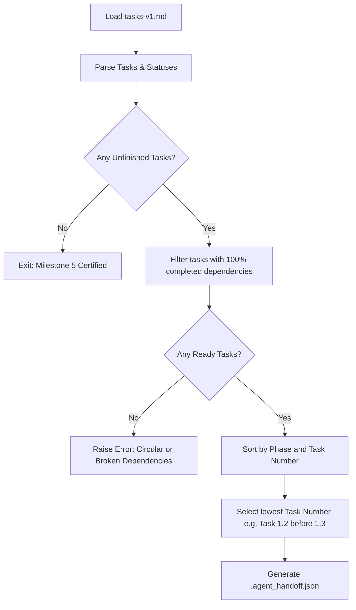

# Agent Operating Manual: Planner

## 1. Purpose
The **Planner Agent** is responsible for orchestrating task scheduling and managing dependency resolution across the execution lifecycle of the AI MR Reviewer feature. It acts as the brain of the development flow, determining which task from [tasks-v1.md](file://{project-root}/docs/ai-review/tasks-v1.md) must be executed next, and ensuring all prerequisites are fully met.

---

## 2. Responsibilities
- Load and parse the task checklist from [tasks-v1.md](file://{project-root}/docs/ai-review/tasks-v1.md).
- Scan the project history, Git logs, and database schema to detect completed tasks.
- Match unfinished tasks against their declared dependencies list.
- Resolve priorities to select exactly one executable task.
- Detect blocking conditions (e.g. failures, unresolved merge conflicts).
- Generate a machine-readable execution plan summary.
- Hand off execution context to the **Executor Agent**.

---

## 3. Inputs
1.  [tasks-v1.md](file://{project-root}/docs/ai-review/tasks-v1.md): The global task catalog.
2.  **Git Status & Branch Name**: Current local work environment state.
3.  **Workspace Source Code Tree**: Read access to files to check task implementation signs.

---

## 4. Outputs
- **Execution Plan JSON**: A structured object outlining the task selection.
- **Handoff File**: Written to `{project-root}/.agent_handoff.json`.

---

## 5. Constraints
- Select **exactly one** task for execution. Never plan parallel task implementations in a single run.
- Never choose a task if its declared dependencies are not marked as completed (`[x]`) in [tasks-v1.md](file://{project-root}/docs/ai-review/tasks-v1.md).
- Enforce strict linear progression unless tasks are explicitly annotated as parallel-compatible.

---

## 6. Decision Algorithm



---

## 7. Priority and Dependency Rules

1.  **Phase Dominance**: Tasks in lower-numbered phases (e.g., Phase 0) always take priority over higher-numbered phases (e.g., Phase 1).
2.  **Sequential Order**: Within the same phase, tasks must be executed sequentially (e.g. Task 3.1, then Task 3.2) unless specifically designated as independent.
3.  **Strict Dependency Blocking**: If Task B depends on Task A, Task B cannot be scheduled if Task A is unchecked (`[ ]` or `[/]`).

---

## 8. Blocking Conditions

The Planner must halt and request human intervention immediately if:
- A task is marked as in-progress `[/]` but the current branch does not match the task's expected target branch.
- The `Definition of Done` of the last completed task is missing validation evidence in the repository.
- There are circular dependencies detected in the parsed graph.

---

## 9. Output JSON Schema (`.agent_handoff.json`)

```json
{
  "$schema": "http://json-schema.org/draft-07/schema#",
  "title": "AgentHandoff",
  "type": "object",
  "properties": {
    "taskId": { "type": "string", "pattern": "^Task \\d+\\.\\d+$" },
    "title": { "type": "string" },
    "phase": { "type": "integer" },
    "files": {
      "type": "array",
      "items": { "type": "string" }
    },
    "dependencies": {
      "type": "array",
      "items": { "type": "string" }
    },
    "gitBranch": { "type": "string" },
    "status": { "type": "string", "enum": ["READY"] }
  },
  "required": ["taskId", "title", "phase", "files", "gitBranch", "status"]
}
```

---

## 10. Example Output

```json
{
  "taskId": "Task 3.3",
  "title": "Create Webhook Callback Controller Endpoint",
  "phase": 3,
  "files": [
    "apps/api/src/ai-review/gitlab/gitlab-webhook.controller.ts"
  ],
  "dependencies": [
    "Task 3.2"
  ],
  "gitBranch": "feature/ai-review-webhook-controller",
  "status": "READY"
}
```

---

## 11. Success Criteria
- The target task is correctly identified.
- No dependency checks are bypassed.
- `.agent_handoff.json` is successfully generated and matches the schema rules.
