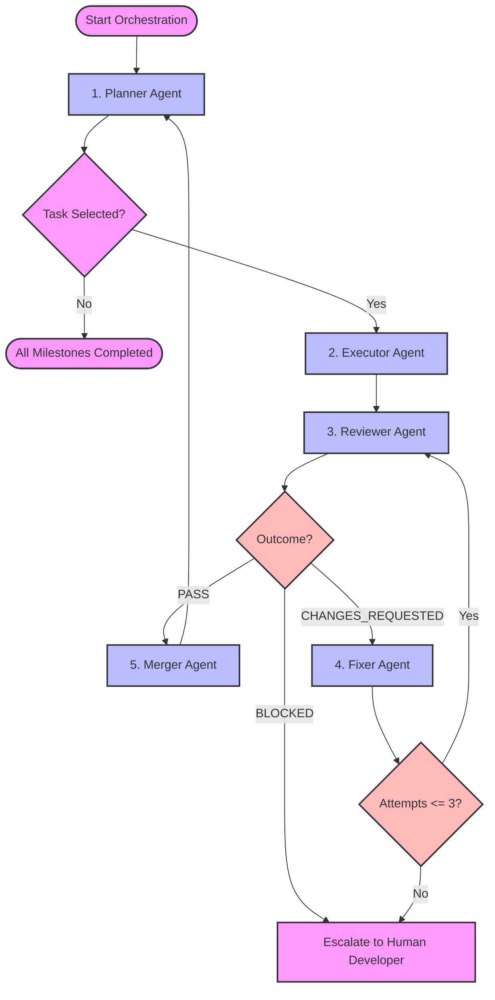

# Agent Orchestration: Workflow

## 1. Purpose
This document maps the complete execution pipeline for the autonomous AI development lifecycle. It details transition states, validation loops, exception paths, and explicit human escalation gates.

---

## 2. Global Workflow Flow

---

## 3. Workflow Transitions

### A. Planning to Execution
- **Trigger**: Planner identifies a ready task and saves `.agent_handoff.json`.
- **Action**: Spawn **Executor Agent** passing handoff configuration.

### B. Execution to Review
- **Trigger**: Executor finishes changes and writes `.executor_result.json`.
- **Action**: Trigger **Reviewer Agent** to run validations on the branch.

### C. Review to Correction / Merge
- **Trigger**: Reviewer publishes `.reviewer_result.json`.
- **Routing**:
  - If status == `PASS`: Invoke **Merger Agent**.
  - If status == `CHANGES_REQUESTED`: Invoke **Fixer Agent**.
  - If status == `BLOCKED`: Immediately abort and escalate.

---

## 4. Human Intervention Gates
Orchestrators must immediately halt execution and request manual help in the following states:
1.  **Dependency Loop**: Unresolved cycles inside task list.
2.  **Review Blocked Status**: Coding conventions violation or security isolation bypasses.
3.  **Correction Threshold Reached**: Fixer exceeds 3 attempts without achieving a `PASS`.
4.  **Git Conflicts**: Merge conflicts during merge back to `main`.
