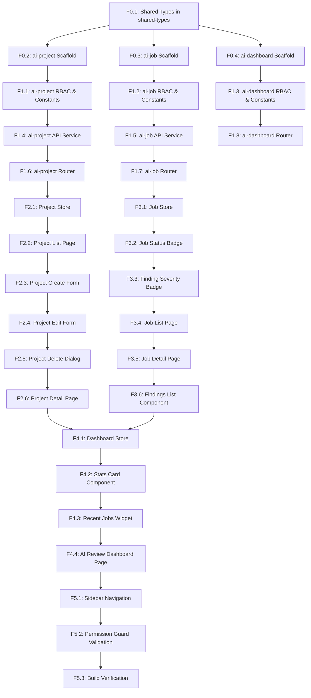

# AI MR Reviewer — Frontend Integration V1 Task Execution Plan

This document serves as the strict, modular, AI-first execution contract for implementing the **AI Merge Request Reviewer** dashboard frontend. The implementation is split into **3 independent modules** following existing Vue 3 + Pinia + PrimeVue + Tailwind CSS v4 conventions.

---

## Module Architecture

Frontend integration uses **3 dedicated modules** instead of a single monolithic module:

| Module Folder | Internal Name | Route Prefix | Responsibility |
|---|---|---|---|
| `modules/ai-dashboard/` | `dashboard` | `/ai-review` | Overview page, stats, recent jobs widget |
| `modules/ai-project/` | `project` | `/ai-review/projects` | Project CRUD management |
| `modules/ai-job/` | `job` | `/ai-review/jobs` | Job monitoring, findings detail |

Shared types (cross-module contracts) live in `packages/shared-types/src/ai-review.ts`.

---

## Milestones

*   **Milestone F1 (Foundation Ready)**: Shared types published, all 3 modules scaffolded with RBAC, API services, and router registered.
*   **Milestone F2 (Project CRUD Done)**: Users can list, create, edit, and delete AI Review Projects through `modules/ai-project/`.
*   **Milestone F3 (Jobs Monitoring Done)**: Users can browse paginated job history and drill into job detail with findings through `modules/ai-job/`.
*   **Milestone F4 (Dashboard Live)**: Summary dashboard page in `modules/ai-dashboard/` aggregates stats and recent jobs.
*   **Milestone F5 (V1 Frontend Complete)**: Sidebar navigation registered, permission guards validated, build passes.

---

## Dependency Graph



---

## Phase F0 — Shared Foundation

### Task F0.1 — Define Shared TypeScript Types in `shared-types`
- **Goal**: Publish cross-module type contracts for Projects, Jobs, and Findings into the shared package.
- **Files**:
  - `packages/shared-types/src/ai-review.ts`
- **Dependencies**: None
- **Implementation**:
  - [ ] Define and export `AiReviewProject` interface (sanitized — no `access_token`, no `webhook_secret`):
    ```ts
    export interface AiReviewProject {
      id: string;
      name: string;
      gitlab_project_id: string;
      gitlab_project_path: string;
      gitlab_base_url: string;
      default_branch: string;
      is_active: boolean;
      auto_review_enabled: boolean;
      review_mode: 'DIFF_ONLY' | 'FULL_FILE';
      max_changed_files: number;
      max_patch_chars: number;
      ignore_patterns: string[];
      created_at: string;
      updated_at: string;
    }
    ```
  - [ ] Define and export `AiReviewJob` interface:
    ```ts
    export interface AiReviewJob {
      id: string;
      project_id: string;
      project?: Pick<AiReviewProject, 'id' | 'name' | 'gitlab_project_path'>;
      status: 'QUEUED' | 'PROCESSING' | 'SUCCESS' | 'FAILED';
      mr_iid: number;
      source_branch: string;
      target_branch: string;
      commit_sha: string;
      files_reviewed: number | null;
      findings_count: number | null;
      duration_ms: number | null;
      error_message: string | null;
      summary_markdown: string | null;
      started_at: string | null;
      completed_at: string | null;
      created_at: string;
    }
    ```
  - [ ] Define and export `AiReviewFinding` interface:
    ```ts
    export interface AiReviewFinding {
      id: string;
      job_id: string;
      severity: 'HIGH' | 'MEDIUM' | 'LOW';
      category: string;
      file_path: string;
      line_start: number | null;
      line_end: number | null;
      title: string;
      description: string;
      suggestion: string | null;
      confidence: number;
      created_at: string;
    }
    ```
  - [ ] Define and export `AiReviewJobDetail` extending `AiReviewJob` with `findings: AiReviewFinding[]`.
  - [ ] Define and export `CreateProjectPayload` and `UpdateProjectPayload` matching backend DTO fields.
  - [ ] Define and export `ListJobsQuery` interface (`project_id?`, `status?`, `page?`, `limit?`).
  - [ ] Re-export from `packages/shared-types/src/index.ts`.
- **Acceptance Criteria**: Package compiles cleanly. Types importable from `@gh-skeleton/shared-types`.
- **Test**: Run compile check inside `packages/shared-types`.
- **Estimated Complexity**: S
- **Labels**: shared-types, typescript

---

### Task F0.2 — Scaffold `modules/ai-project/` Directory
- **Goal**: Create the project management module folder structure.
- **Files**:
  - `apps/web/src/modules/ai-project/pages/.gitkeep`
  - `apps/web/src/modules/ai-project/components/.gitkeep`
  - `apps/web/src/modules/ai-project/services/.gitkeep`
  - `apps/web/src/modules/ai-project/stores/.gitkeep`
  - `apps/web/src/modules/ai-project/router/.gitkeep`
- **Dependencies**: Task F0.1
- **Implementation**:
  - [ ] Create all subdirectories following `apps/web/src/modules/settings/` pattern.
- **Acceptance Criteria**: Directory layout exists and matches module convention.
- **Test**: `ls -R apps/web/src/modules/ai-project/`
- **Estimated Complexity**: XS
- **Labels**: frontend, scaffold

---

### Task F0.3 — Scaffold `modules/ai-job/` Directory
- **Goal**: Create the job monitoring module folder structure.
- **Files**:
  - `apps/web/src/modules/ai-job/pages/.gitkeep`
  - `apps/web/src/modules/ai-job/components/.gitkeep`
  - `apps/web/src/modules/ai-job/services/.gitkeep`
  - `apps/web/src/modules/ai-job/stores/.gitkeep`
  - `apps/web/src/modules/ai-job/router/.gitkeep`
- **Dependencies**: Task F0.1
- **Implementation**:
  - [ ] Create all subdirectories following module convention.
- **Acceptance Criteria**: Directory layout exists.
- **Test**: `ls -R apps/web/src/modules/ai-job/`
- **Estimated Complexity**: XS
- **Labels**: frontend, scaffold

---

### Task F0.4 — Scaffold `modules/ai-dashboard/` Directory
- **Goal**: Create the AI review dashboard module folder structure.
- **Files**:
  - `apps/web/src/modules/ai-dashboard/pages/.gitkeep`
  - `apps/web/src/modules/ai-dashboard/components/.gitkeep`
  - `apps/web/src/modules/ai-dashboard/services/.gitkeep`
  - `apps/web/src/modules/ai-dashboard/stores/.gitkeep`
  - `apps/web/src/modules/ai-dashboard/router/.gitkeep`
- **Dependencies**: Task F0.1
- **Implementation**:
  - [ ] Create all subdirectories following module convention.
- **Acceptance Criteria**: Directory layout exists.
- **Test**: `ls -R apps/web/src/modules/ai-dashboard/`
- **Estimated Complexity**: XS
- **Labels**: frontend, scaffold

---

## Phase F1 — Module Bootstrap

### Task F1.1 — Define `ai-project` RBAC and Constants
- **Goal**: Declare all permission keys and route constants for the project management module.
- **Files**:
  - `apps/web/src/modules/ai-project/services/rbac.ts`
  - `apps/web/src/modules/ai-project/services/constants.ts`
- **Dependencies**: Task F0.2
- **Implementation**:
  - [ ] In `rbac.ts`, export permission constants:
    ```ts
    export const PROJECT_CREATE = 'ai_review.projects.create';
    export const PROJECT_READ   = 'ai_review.projects.read';
    export const PROJECT_UPDATE = 'ai_review.projects.update';
    export const PROJECT_DELETE = 'ai_review.projects.delete';
    export const PERMISSIONS    = [PROJECT_CREATE, PROJECT_READ, PROJECT_UPDATE, PROJECT_DELETE];
    ```
  - [ ] In `constants.ts`, export:
    ```ts
    export const FEATURE_NAME        = 'project';
    export const MODULE_VERSION      = '1.0.0';
    export const PREFIX_ROUTE_PATH   = '/ai-review/projects';
    export const PREFIX_ROUTE_NAME   = 'ai-review-project';
    ```
- **Acceptance Criteria**: Imports compile. Permission strings match backend `@RequirePermission(...)` values.
- **Test**: Import and verify constant values.
- **Estimated Complexity**: XS
- **Labels**: frontend, rbac

---

### Task F1.2 — Define `ai-job` RBAC and Constants
- **Goal**: Declare all permission keys and route constants for the job monitoring module.
- **Files**:
  - `apps/web/src/modules/ai-job/services/rbac.ts`
  - `apps/web/src/modules/ai-job/services/constants.ts`
- **Dependencies**: Task F0.3
- **Implementation**:
  - [ ] In `rbac.ts`, export:
    ```ts
    export const JOB_READ    = 'ai_review.jobs.read';
    export const PERMISSIONS = [JOB_READ];
    ```
  - [ ] In `constants.ts`, export:
    ```ts
    export const FEATURE_NAME        = 'job';
    export const MODULE_VERSION      = '1.0.0';
    export const PREFIX_ROUTE_PATH   = '/ai-review/jobs';
    export const PREFIX_ROUTE_NAME   = 'ai-review-job';
    ```
- **Acceptance Criteria**: Imports compile cleanly.
- **Test**: Import and verify values.
- **Estimated Complexity**: XS
- **Labels**: frontend, rbac

---

### Task F1.3 — Define `ai-dashboard` RBAC and Constants
- **Goal**: Declare permission keys and route constants for the AI review dashboard module.
- **Files**:
  - `apps/web/src/modules/ai-dashboard/services/rbac.ts`
  - `apps/web/src/modules/ai-dashboard/services/constants.ts`
- **Dependencies**: Task F0.4
- **Implementation**:
  - [ ] In `rbac.ts`, import and re-export from project + job modules:
    ```ts
    export const PERMISSIONS = [
      'ai_review.projects.read',
      'ai_review.jobs.read',
    ];
    ```
  - [ ] In `constants.ts`, export:
    ```ts
    export const FEATURE_NAME        = 'dashboard';
    export const MODULE_VERSION      = '1.0.0';
    export const PREFIX_ROUTE_PATH   = '/ai-review';
    export const PREFIX_ROUTE_NAME   = 'ai-review';
    ```
- **Acceptance Criteria**: Imports compile cleanly.
- **Test**: Import and verify values.
- **Estimated Complexity**: XS
- **Labels**: frontend, rbac

---

### Task F1.4 — Implement `ai-project` API Service
- **Goal**: Create HTTP client functions for all project-related API endpoints.
- **Files**:
  - `apps/web/src/modules/ai-project/services/api.ts`
- **Dependencies**: Task F1.1
- **Implementation**:
  - [ ] Import shared axios client from `@/plugins/axios.ts`.
  - [ ] Import types from `@gh-skeleton/shared-types`.
  - [ ] Implement `getProjects()` → `GET /api/ai-review/projects`.
  - [ ] Implement `getProject(id: string)` → `GET /api/ai-review/projects/:id`.
  - [ ] Implement `createProject(data: CreateProjectPayload)` → `POST /api/ai-review/projects`.
  - [ ] Implement `updateProject(id: string, data: UpdateProjectPayload)` → `PATCH /api/ai-review/projects/:id`.
  - [ ] Implement `deleteProject(id: string)` → `DELETE /api/ai-review/projects/:id`.
- **Acceptance Criteria**: All functions return typed axios promises. TypeScript compiles without errors.
- **Test**: Import and verify function signatures.
- **Estimated Complexity**: S
- **Labels**: frontend, api

---

### Task F1.5 — Implement `ai-job` API Service
- **Goal**: Create HTTP client functions for all job-related API endpoints.
- **Files**:
  - `apps/web/src/modules/ai-job/services/api.ts`
- **Dependencies**: Task F1.2
- **Implementation**:
  - [ ] Import shared axios client from `@/plugins/axios.ts`.
  - [ ] Import types from `@gh-skeleton/shared-types`.
  - [ ] Implement `getJobs(query?: ListJobsQuery)` → `GET /api/ai-review/jobs` (with query params: `project_id`, `status`, `page`, `limit`).
  - [ ] Implement `getJob(id: string)` → `GET /api/ai-review/jobs/:id`.
- **Acceptance Criteria**: Functions compile cleanly with correct return types.
- **Test**: Import and verify function signatures.
- **Estimated Complexity**: S
- **Labels**: frontend, api

---

### Task F1.6 — Define `ai-project` Vue Router Routes
- **Goal**: Register all project page routes using the established router convention.
- **Files**:
  - `apps/web/src/modules/ai-project/router/index.ts`
- **Dependencies**: Task F1.4
- **Implementation**:
  - [ ] Import `PREFIX_ROUTE_PATH`, `PREFIX_ROUTE_NAME`, and RBAC constants.
  - [ ] Define routes with `layout: 'default'` and correct `meta.permission`:
    - **Project List** (`/ai-review/projects`) — `permission: [PROJECT_READ]`
    - **Project Create** (`/ai-review/projects/create`) — `permission: [PROJECT_CREATE]`
    - **Project Detail** (`/ai-review/projects/:id`) — `permission: [PROJECT_READ]`
    - **Project Edit** (`/ai-review/projects/:id/edit`) — `permission: [PROJECT_UPDATE]`
  - [ ] Include correct `breadcrumbs` meta for each route (with Home → AI Review → Projects → ...).
- **Acceptance Criteria**: Routes registered. Permission guard redirects unauthorized users to `403`.
- **Test**: Navigate to each route and confirm access control.
- **Estimated Complexity**: S
- **Labels**: frontend, router

---

### Task F1.7 — Define `ai-job` Vue Router Routes
- **Goal**: Register all job page routes using the established router convention.
- **Files**:
  - `apps/web/src/modules/ai-job/router/index.ts`
- **Dependencies**: Task F1.5
- **Implementation**:
  - [ ] Import constants and RBAC from `ai-job` services.
  - [ ] Define routes:
    - **Job List** (`/ai-review/jobs`) — `permission: [JOB_READ]`
    - **Job Detail** (`/ai-review/jobs/:id`) — `permission: [JOB_READ]`
  - [ ] Include correct `breadcrumbs` meta.
- **Acceptance Criteria**: Routes registered. Unauthorized access redirects to `403`.
- **Test**: Navigate to each route and confirm access control.
- **Estimated Complexity**: S
- **Labels**: frontend, router

---

### Task F1.8 — Define `ai-dashboard` Vue Router Route
- **Goal**: Register the AI review dashboard route.
- **Files**:
  - `apps/web/src/modules/ai-dashboard/router/index.ts`
- **Dependencies**: Task F1.3
- **Implementation**:
  - [ ] Import constants and RBAC from `ai-dashboard` services.
  - [ ] Define route:
    - **AI Review Dashboard** (`/ai-review`) — `layout: 'default'`, `permission: PERMISSIONS`
  - [ ] Include correct `breadcrumbs` meta: Home → AI Review.
- **Acceptance Criteria**: Dashboard route registered and accessible.
- **Test**: Navigate to `/ai-review` and confirm page renders.
- **Estimated Complexity**: XS
- **Labels**: frontend, router

---

## Phase F2 — `ai-project` Store and Pages

### Task F2.1 — Implement `ai-project` Pinia Store
- **Goal**: Implement the complete Pinia store for project state management in the `ai-project` module.
- **Files**:
  - `apps/web/src/modules/ai-project/stores/state.ts`
  - `apps/web/src/modules/ai-project/stores/getters.ts`
  - `apps/web/src/modules/ai-project/stores/actions.ts`
  - `apps/web/src/modules/ai-project/stores/index.ts`
- **Dependencies**: Task F1.6
- **Implementation**:
  - [ ] `state.ts`: Define state with `projects: AiReviewProject[]`, `project: AiReviewProject | null`, `isLoading: boolean`, `isSubmitting: boolean`, `error: string | null`.
  - [ ] `getters.ts`: Define `projectById(id)`, `totalProjects`, `activeProjects`.
  - [ ] `actions.ts`: Implement `fetchProjects()`, `fetchProject(id)`, `createProject(data)`, `updateProject(id, data)`, `deleteProject(id)`. Handle `isLoading`, `isSubmitting`, and `error` state in each action.
  - [ ] `index.ts`: Compose and export `useProjectStore` via `defineStore('project', { state, getters, actions })`.
- **Acceptance Criteria**: All actions update state correctly. Error paths set `state.error`. Store name is `project` (no `ai-` prefix).
- **Test**: Mock API calls and assert state mutations.
- **Estimated Complexity**: M
- **Labels**: frontend, pinia

---

### Task F2.2 — Build Project List Page
- **Goal**: Create a list page displaying all AI Review Projects configured for the current merchant.
- **Files**:
  - `apps/web/src/modules/ai-project/pages/project-list.vue`
- **Dependencies**: Task F2.1
- **Implementation**:
  - [ ] Use `useProjectStore()` to call `fetchProjects()` on `onMounted`.
  - [ ] Render PrimeVue `DataTable` with columns: Name, GitLab Project Path, Branch, Status (active chip), Review Mode, Created At, Actions.
  - [ ] Loading skeleton bound to `isLoading`.
  - [ ] Empty state message when `projects.length === 0`.
  - [ ] "Add Project" button navigating to create page (conditionally shown by `PROJECT_CREATE` permission).
  - [ ] Per-row action buttons: "View" (→ detail), "Edit" (→ edit), "Delete" (→ opens `DeleteProjectDialog`).
- **Acceptance Criteria**: List renders with all columns. Empty state visible. Actions navigate correctly.
- **Test**: Manual browser test with mocked API.
- **Estimated Complexity**: M
- **Labels**: frontend, vue, ui

---

### Task F2.3 — Build `ProjectForm` Shared Component and Create Page
- **Goal**: Implement the reusable project form component and the create page that uses it.
- **Files**:
  - `apps/web/src/modules/ai-project/components/ProjectForm.vue`
  - `apps/web/src/modules/ai-project/pages/project-create.vue`
- **Dependencies**: Task F2.2
- **Implementation**:
  - [ ] `ProjectForm.vue`: Accept `modelValue` and `isSubmitting` props. Emit `update:modelValue` on field change. Fields:
    - `name` (text, required)
    - `gitlab_base_url` (text, optional, default: `https://gitlab.com`)
    - `gitlab_project_id` (text, required)
    - `gitlab_project_path` (text, required)
    - `webhook_secret` (password input with reveal toggle, required)
    - `access_token` (password input with reveal toggle, required)
    - `default_branch` (text, optional, default: `main`)
    - `is_active` (PrimeVue `ToggleSwitch`)
    - `auto_review_enabled` (PrimeVue `ToggleSwitch`)
    - `review_mode` (PrimeVue `Select`: `DIFF_ONLY` / `FULL_FILE`)
    - `max_changed_files` (number input, 1–100)
    - `max_patch_chars` (number input, 1000–500000)
    - `ignore_patterns` (PrimeVue `Chips` or tag input)
  - [ ] `project-create.vue`: Renders `ProjectForm`. On submit calls `createProject(data)`. Shows PrimeVue toast on success/error. Redirects to project list on success.
- **Acceptance Criteria**: Form validates required fields. Create submission works. Redirect on success.
- **Test**: Fill all fields, submit, and verify store action called.
- **Estimated Complexity**: L
- **Labels**: frontend, vue, form, ui

---

### Task F2.4 — Build Project Edit Page
- **Goal**: Implement an edit page pre-filled with existing project data.
- **Files**:
  - `apps/web/src/modules/ai-project/pages/project-edit.vue`
- **Dependencies**: Task F2.3
- **Implementation**:
  - [ ] Reuse `ProjectForm.vue`.
  - [ ] On `onMounted`, call `fetchProject(route.params.id)` and pre-fill form from `store.project`.
  - [ ] `webhook_secret` and `access_token` fields: show placeholder `"••••••••"` — only send value to API if user types new value.
  - [ ] On submit, call `updateProject(id, data)`.
  - [ ] Show toast on success/error. Redirect to project detail on success.
- **Acceptance Criteria**: Form pre-fills non-secret fields. Secret fields show placeholder. Update works correctly.
- **Test**: Load page with mocked project data and verify pre-population.
- **Estimated Complexity**: M
- **Labels**: frontend, vue, form

---

### Task F2.5 — Build `DeleteProjectDialog` Component
- **Goal**: Implement a delete confirmation dialog to prevent accidental project removal.
- **Files**:
  - `apps/web/src/modules/ai-project/components/DeleteProjectDialog.vue`
- **Dependencies**: Task F2.4
- **Implementation**:
  - [ ] Use PrimeVue `Dialog` component.
  - [ ] Props: `project: AiReviewProject`, `visible: boolean` (v-model).
  - [ ] Confirmation message displays project `name`.
  - [ ] On confirm: call `deleteProject(project.id)`. Show loading state on confirm button.
  - [ ] On success: emit `deleted` event, close dialog, navigate to project list.
  - [ ] On cancel: close dialog, no action.
- **Acceptance Criteria**: Dialog shows project name. Confirm triggers delete with loading state. Cancel closes cleanly.
- **Test**: Open dialog, confirm, verify store action called and navigation occurs.
- **Estimated Complexity**: S
- **Labels**: frontend, vue, component

---

### Task F2.6 — Build Project Detail Page
- **Goal**: Display full details of a single project and a preview of its recent review jobs.
- **Files**:
  - `apps/web/src/modules/ai-project/pages/project-detail.vue`
- **Dependencies**: Task F2.5
- **Implementation**:
  - [ ] On `onMounted`, call `fetchProject(id)`.
  - [ ] Optionally call `getJobs({ project_id: id, limit: 5 })` from `ai-job` API service directly (no store dependency to avoid cross-module store coupling).
  - [ ] Project metadata card: name, GitLab URL, project path, branch, review mode, limits.
  - [ ] Status chips: `is_active`, `auto_review_enabled`.
  - [ ] `ignore_patterns` rendered as tag chips.
  - [ ] "Recent Jobs" section: simple table with last 5 jobs — columns: Status, MR IID, Branch, Created At. Each row links to `/ai-review/jobs/:id`.
  - [ ] Action buttons: "Edit" → project edit page, "Delete" → opens `DeleteProjectDialog`, "View All Jobs" → `/ai-review/jobs?project_id=:id`.
- **Acceptance Criteria**: All metadata sections visible. Recent jobs table renders. Actions navigate correctly.
- **Test**: Navigate to detail page with mocked project data.
- **Estimated Complexity**: M
- **Labels**: frontend, vue, ui

---

## Phase F3 — `ai-job` Store, Components, and Pages

### Task F3.1 — Implement `ai-job` Pinia Store
- **Goal**: Implement the complete Pinia store for job state management in the `ai-job` module.
- **Files**:
  - `apps/web/src/modules/ai-job/stores/state.ts`
  - `apps/web/src/modules/ai-job/stores/getters.ts`
  - `apps/web/src/modules/ai-job/stores/actions.ts`
  - `apps/web/src/modules/ai-job/stores/index.ts`
- **Dependencies**: Task F1.7
- **Implementation**:
  - [ ] `state.ts`: Define `jobs: AiReviewJob[]`, `job: AiReviewJobDetail | null`, `isLoading: boolean`, `meta: PaginationMeta | null`, `filters: ListJobsQuery`.
  - [ ] `getters.ts`: Define `jobById(id)`, `jobsByStatus(status)`.
  - [ ] `actions.ts`: Implement `fetchJobs(query?)`, `fetchJob(id)`, `setFilters(filters)`.
  - [ ] `index.ts`: Export `useJobStore` via `defineStore('job', { state, getters, actions })`.
- **Acceptance Criteria**: Store name is `job` (no prefix). All actions update state and pagination meta correctly.
- **Test**: Mock API calls and assert state updates.
- **Estimated Complexity**: M
- **Labels**: frontend, pinia

---

### Task F3.2 — Build `JobStatusBadge` Component
- **Goal**: Create a reusable badge component for displaying job processing status.
- **Files**:
  - `apps/web/src/modules/ai-job/components/JobStatusBadge.vue`
- **Dependencies**: Task F3.1
- **Implementation**:
  - [ ] Accept `status: 'QUEUED' | 'PROCESSING' | 'SUCCESS' | 'FAILED'` prop.
  - [ ] Render PrimeVue `Tag` with mapped severity and icon:
    - `QUEUED` → secondary, `pi-clock`
    - `PROCESSING` → info, `pi-spin pi-spinner`
    - `SUCCESS` → success, `pi-check-circle`
    - `FAILED` → danger, `pi-times-circle`
- **Acceptance Criteria**: Badge renders correct color and icon for all 4 status values.
- **Test**: Render each variant and visually verify.
- **Estimated Complexity**: XS
- **Labels**: frontend, vue, component

---

### Task F3.3 — Build `FindingSeverityBadge` Component
- **Goal**: Create a reusable badge component for displaying finding severity levels.
- **Files**:
  - `apps/web/src/modules/ai-job/components/FindingSeverityBadge.vue`
- **Dependencies**: Task F3.2
- **Implementation**:
  - [ ] Accept `severity: 'HIGH' | 'MEDIUM' | 'LOW'` prop.
  - [ ] Render PrimeVue `Tag` with mapped severity and icon:
    - `HIGH` → danger, `pi-exclamation-circle`
    - `MEDIUM` → warn, `pi-exclamation-triangle`
    - `LOW` → info, `pi-info-circle`
- **Acceptance Criteria**: Badge renders correct color and icon for all 3 severity values.
- **Test**: Render each variant and visually verify.
- **Estimated Complexity**: XS
- **Labels**: frontend, vue, component

---

### Task F3.4 — Build Job List Page
- **Goal**: Create a paginated, filterable list of all review jobs across projects.
- **Files**:
  - `apps/web/src/modules/ai-job/pages/job-list.vue`
- **Dependencies**: Task F3.2
- **Implementation**:
  - [ ] Use `useJobStore()` to call `fetchJobs()` on `onMounted`.
  - [ ] PrimeVue `DataTable` columns: Project, MR IID, Source Branch → Target Branch, Status (JobStatusBadge), Files Reviewed, Findings, Duration, Created At, Actions.
  - [ ] Filter toolbar: `project_id` (Select dropdown from `getProjects()` call), `status` (Select: all/QUEUED/PROCESSING/SUCCESS/FAILED).
  - [ ] Pagination controls bound to `meta`.
  - [ ] Loading skeleton and empty state.
  - [ ] Each row "View" action → job detail page.
- **Acceptance Criteria**: List renders with filters. Pagination works. Status column uses `JobStatusBadge`.
- **Test**: Manual browser test with mock data.
- **Estimated Complexity**: M
- **Labels**: frontend, vue, ui

---

### Task F3.5 — Build Job Detail Page
- **Goal**: Display complete details of a single review job including metadata, markdown summary, and findings.
- **Files**:
  - `apps/web/src/modules/ai-job/pages/job-detail.vue`
- **Dependencies**: Task F3.3
- **Implementation**:
  - [ ] On `onMounted`, call `fetchJob(id)`.
  - [ ] Header section: Project name (linked to project detail), MR IID, source → target branch, commit SHA.
  - [ ] Execution stats row: `JobStatusBadge`, started_at, completed_at, duration_ms (formatted), files_reviewed, findings_count.
  - [ ] Error alert card: shown only when `status === 'FAILED'` and `error_message` is present.
  - [ ] Summary section: render `summary_markdown` content inside a styled `<pre>` block or markdown renderer.
  - [ ] Findings section: delegate to `FindingsList.vue` component.
  - [ ] "Back to Jobs" breadcrumb/button.
- **Acceptance Criteria**: All sections visible. Error card shows for failed jobs. Findings render via component.
- **Test**: Load with mocked SUCCESS and FAILED job data.
- **Estimated Complexity**: M
- **Labels**: frontend, vue, ui

---

### Task F3.6 — Build `FindingsList` Component
- **Goal**: Create a component rendering grouped, sortable findings from a review job.
- **Files**:
  - `apps/web/src/modules/ai-job/components/FindingsList.vue`
- **Dependencies**: Task F3.5
- **Implementation**:
  - [ ] Accept `findings: AiReviewFinding[]` prop.
  - [ ] Display summary header: "X HIGH · Y MEDIUM · Z LOW" counts.
  - [ ] Group and sort findings: `HIGH` → `MEDIUM` → `LOW`.
  - [ ] Per-finding card:
    - `FindingSeverityBadge` + Category tag
    - File path and line range (`file_path:line_start-line_end`)
    - Title (bold) and description
    - Suggestion block (if `suggestion` is not null)
    - Confidence bar — numeric percentage display (e.g., "Confidence: 87%")
  - [ ] Empty state message when `findings.length === 0`.
- **Acceptance Criteria**: Grouped correctly. All fields render. Empty state visible.
- **Test**: Render with array containing HIGH, MEDIUM, and LOW findings.
- **Estimated Complexity**: M
- **Labels**: frontend, vue, component

---

## Phase F4 — `ai-dashboard` Store, Components, and Page

### Task F4.1 — Implement `ai-dashboard` Pinia Store
- **Goal**: Implement a lightweight store aggregating stats for the AI review dashboard.
- **Files**:
  - `apps/web/src/modules/ai-dashboard/stores/state.ts`
  - `apps/web/src/modules/ai-dashboard/stores/getters.ts`
  - `apps/web/src/modules/ai-dashboard/stores/actions.ts`
  - `apps/web/src/modules/ai-dashboard/stores/index.ts`
- **Dependencies**: Task F3.6
- **Implementation**:
  - [ ] `state.ts`: Define `projects: AiReviewProject[]`, `recentJobs: AiReviewJob[]`, `isLoading: boolean`.
  - [ ] `getters.ts`: Define computed stats:
    - `totalProjects`: `projects.length`
    - `activeProjects`: `projects.filter(p => p.is_active).length`
    - `successRate`: `(SUCCESS count / total jobs) * 100`
  - [ ] `actions.ts`: `fetchDashboardData()` — calls `getProjects()` and `getJobs({ limit: 5 })` from respective API services. Updates state.
  - [ ] `index.ts`: Export `useDashboardStore` via `defineStore('dashboard', ...)`.
- **Acceptance Criteria**: Store name is `dashboard`. Getters compute stats correctly. `fetchDashboardData()` populates state.
- **Test**: Mock API calls and assert computed getter values.
- **Estimated Complexity**: M
- **Labels**: frontend, pinia

---

### Task F4.2 — Build `StatsCard` Component
- **Goal**: Create a reusable summary stats card for the dashboard overview row.
- **Files**:
  - `apps/web/src/modules/ai-dashboard/components/StatsCard.vue`
- **Dependencies**: Task F4.1
- **Implementation**:
  - [ ] Props: `label: string`, `value: string | number`, `icon: string`, `color: string`, `trend?: string`.
  - [ ] Render a card with icon, label text, and prominent value.
  - [ ] Optional `trend` slot: display with arrow indicator (e.g., "↑ 12% this week").
  - [ ] Tailwind CSS responsive grid-friendly sizing.
- **Acceptance Criteria**: Renders all props. Trend indicator optional and styled correctly.
- **Test**: Render with and without `trend` prop.
- **Estimated Complexity**: S
- **Labels**: frontend, vue, component

---

### Task F4.3 — Build `RecentJobsWidget` Component
- **Goal**: Create a dashboard widget showing the last 5 review jobs at a glance.
- **Files**:
  - `apps/web/src/modules/ai-dashboard/components/RecentJobsWidget.vue`
- **Dependencies**: Task F4.2
- **Implementation**:
  - [ ] Props: `jobs: AiReviewJob[]`.
  - [ ] Compact list: project name, MR IID, `JobStatusBadge`, relative created_at (e.g., "3 hours ago").
  - [ ] Import `JobStatusBadge` from `@/modules/ai-job/components/JobStatusBadge.vue`.
  - [ ] "View All Jobs" link → `/ai-review/jobs`.
  - [ ] Empty state when `jobs.length === 0`.
- **Acceptance Criteria**: Renders up to 5 jobs. Status badge renders. Link navigates correctly.
- **Test**: Render with 5 mock jobs.
- **Estimated Complexity**: S
- **Labels**: frontend, vue, component

---

### Task F4.4 — Build AI Review Dashboard Page
- **Goal**: Assemble the main `/ai-review` dashboard page for the AI reviewer feature.
- **Files**:
  - `apps/web/src/modules/ai-dashboard/pages/dashboard.vue`
- **Dependencies**: Task F4.3
- **Implementation**:
  - [ ] Use `useDashboardStore()`. Call `fetchDashboardData()` on `onMounted`.
  - [ ] Page header: title "AI Code Review", subtitle "Monitor your automated MR reviews".
  - [ ] Stats row — 4 `StatsCard` components:
    - "Total Projects" (`totalProjects`), icon `pi-folder`
    - "Active Projects" (`activeProjects`), icon `pi-check`
    - "Jobs Today" (jobs created today count), icon `pi-clock`
    - "Success Rate" (`successRate`%), icon `pi-chart-line`
  - [ ] `RecentJobsWidget` below stats row.
  - [ ] Quick action buttons: "Add Project" → `/ai-review/projects/create`, "View All Jobs" → `/ai-review/jobs`.
- **Acceptance Criteria**: Stats computed correctly. Widget renders. Loading state visible while fetching.
- **Test**: Manual browser test with mocked API responses.
- **Estimated Complexity**: M
- **Labels**: frontend, vue, ui, dashboard

---

## Phase F5 — Integration and Polish

### Task F5.1 — Add AI Review Entries to Sidebar Navigation
- **Goal**: Register all AI Review module entry points in the dashboard sidebar navigation.
- **Files**: Locate the sidebar navigation config (e.g., `apps/web/src/layouts/` or `apps/web/src/core/`).
- **Dependencies**: Task F4.4
- **Implementation**:
  - [ ] Locate the sidebar navigation item definition file.
  - [ ] Add a nav group "AI Review" with icon `pi-code` and sub-items:
    - "Overview" → route `ai-review`, permission `ai_review.projects.read`
    - "Projects" → route `ai-review-project`, permission `ai_review.projects.read`
    - "Jobs" → route `ai-review-job`, permission `ai_review.jobs.read`
  - [ ] Ensure the group and sub-items are hidden if user lacks all permissions.
- **Acceptance Criteria**: Sidebar shows "AI Review" group for users with required permissions. Hidden for users without.
- **Test**: Login with and without `ai_review.*` permissions, verify visibility.
- **Estimated Complexity**: S
- **Labels**: frontend, navigation, ui

---

### Task F5.2 — Validate Permission Guards Across All Three Modules
- **Goal**: Verify RBAC permission guards are correctly applied to all AI Review routes.
- **Files**: All `router/index.ts` files in `ai-project/`, `ai-job/`, `ai-dashboard/`.
- **Dependencies**: Task F5.1
- **Implementation**:
  - [ ] Audit `meta.permission` on every route — confirm matches `rbac.ts` constants.
  - [ ] Test: user with no `ai_review.*` permissions → all routes redirect to `403`.
  - [ ] Test: user with read-only (`ai_review.projects.read`, `ai_review.jobs.read`) → create/edit routes redirect to `403`.
  - [ ] Test: user with full permissions → all routes accessible.
- **Acceptance Criteria**: Permission guard enforced correctly across all 3 modules.
- **Test**: Use test accounts with different permission profiles.
- **Estimated Complexity**: S
- **Labels**: frontend, security, rbac

---

### Task F5.3 — Run Build Verification
- **Goal**: Confirm the entire Vue 3 frontend compiles cleanly with all 3 new modules included.
- **Files**: `apps/web/`
- **Dependencies**: Task F5.2
- **Implementation**:
  - [ ] Run `npm run build` inside `apps/web/`.
  - [ ] Resolve all `vue-tsc` TypeScript errors in new module files.
  - [ ] Resolve all unused import warnings.
  - [ ] Confirm exit code `0`.
- **Acceptance Criteria**: `npm run build` completes with code 0. No type errors.
- **Test**: Terminal output of `npm run build`.
- **Estimated Complexity**: M
- **Labels**: frontend, build, verification

---

## Definition of Done (DoD)

Before marking any task complete, the following must be verified:

1.  **TypeScript Verification**: `npm run build` (`vue-tsc -b && vite build`) compiles without error.
2.  **Convention Compliance**: Each module follows folder structure from `apps/web/AGENTS.md`.
3.  **Store Naming**: Store IDs use `project`, `job`, `dashboard` — no `ai-` prefix in store name.
4.  **RBAC Applied**: Every route has correct `meta.permission` matching backend permission keys.
5.  **API Contract Matched**: Service functions use correct HTTP methods and paths matching backend controllers.
6.  **Store Pattern Followed**: Each store split into `state.ts`, `getters.ts`, `actions.ts`, `index.ts`.
7.  **No Hardcoded Strings**: All permission keys, route paths, and API paths use exported constants.
8.  **No Cross-Module Store Coupling**: Modules import API services from sibling modules if needed — not stores.
9.  **No Broken Existing Flow**: Changes do not break any existing modules or navigation.

---

## File Map Summary

```
apps/web/src/modules/
│
├── ai-project/
│   ├── pages/
│   │   ├── project-list.vue       ← F2.2
│   │   ├── project-create.vue     ← F2.3
│   │   ├── project-edit.vue       ← F2.4
│   │   └── project-detail.vue     ← F2.6
│   ├── components/
│   │   ├── ProjectForm.vue        ← F2.3
│   │   └── DeleteProjectDialog.vue← F2.5
│   ├── services/
│   │   ├── api.ts                 ← F1.4
│   │   ├── constants.ts           ← F1.1
│   │   └── rbac.ts                ← F1.1
│   ├── stores/
│   │   ├── state.ts               ← F2.1
│   │   ├── getters.ts             ← F2.1
│   │   ├── actions.ts             ← F2.1
│   │   └── index.ts               ← F2.1  (store id: 'project')
│   └── router/
│       └── index.ts               ← F1.6
│
├── ai-job/
│   ├── pages/
│   │   ├── job-list.vue           ← F3.4
│   │   └── job-detail.vue         ← F3.5
│   ├── components/
│   │   ├── JobStatusBadge.vue     ← F3.2
│   │   ├── FindingSeverityBadge.vue ← F3.3
│   │   └── FindingsList.vue       ← F3.6
│   ├── services/
│   │   ├── api.ts                 ← F1.5
│   │   ├── constants.ts           ← F1.2
│   │   └── rbac.ts                ← F1.2
│   ├── stores/
│   │   ├── state.ts               ← F3.1
│   │   ├── getters.ts             ← F3.1
│   │   ├── actions.ts             ← F3.1
│   │   └── index.ts               ← F3.1  (store id: 'job')
│   └── router/
│       └── index.ts               ← F1.7
│
├── ai-dashboard/
│   ├── pages/
│   │   └── dashboard.vue          ← F4.4
│   ├── components/
│   │   ├── StatsCard.vue          ← F4.2
│   │   └── RecentJobsWidget.vue   ← F4.3
│   ├── services/
│   │   ├── constants.ts           ← F1.3
│   │   └── rbac.ts                ← F1.3
│   ├── stores/
│   │   ├── state.ts               ← F4.1
│   │   ├── getters.ts             ← F4.1
│   │   ├── actions.ts             ← F4.1
│   │   └── index.ts               ← F4.1  (store id: 'dashboard')
│   └── router/
│       └── index.ts               ← F1.8
│
packages/shared-types/src/
└── ai-review.ts                   ← F0.1
```
