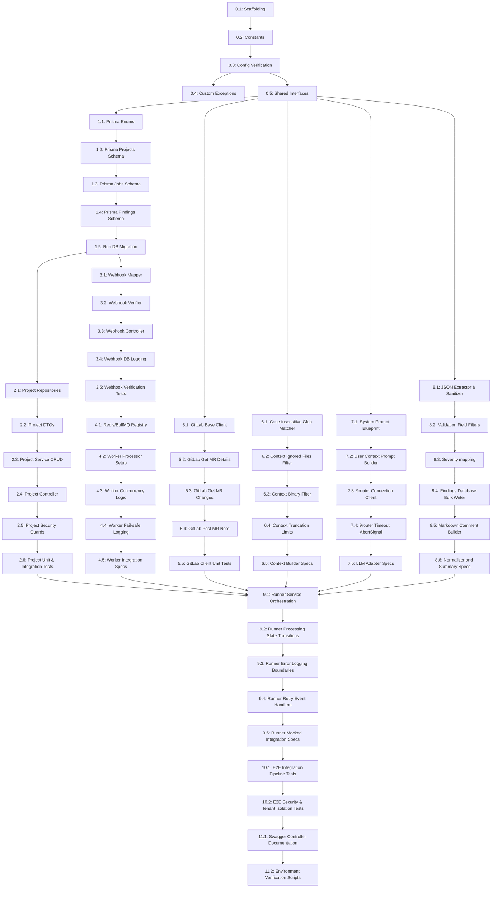

# AI MR Reviewer V1 — Task Execution Plan

This document serves as the strict, modular, AI-first execution contract. It decomposes the implementation of the AI Merge Request Reviewer V1 into 56 discrete, testable, and independently mergeable tasks.

---

## Milestones

*   **Milestone 1 (Webhook Working)**: Webhook controller receives events, verifies GitLab signature tokens, logs, and creates a database job entry.
*   **Milestone 2 (Queue Working)**: BullMQ worker successfully retrieves the enqueued job ID and invokes the runner service asynchronously.
*   **Milestone 3 (LLM Working)**: Context builder processes file diffs and the LLM Adapter receives a structured JSON critique from 9router.
*   **Milestone 4 (MR Review Published)**: The parsed critique markdown summary is published back to the GitLab Merge Request thread note.
*   **Milestone 5 (V1 Complete)**: End-to-end integration tests, role verification, and Swagger documentation are fully certified.

---

## Dependency Graph



---

## Phase 0 — Foundation

### Task 0.1 — Create Directory Scaffolding
- **Goal**: Initialize target folders inside the `ai-review` module directory structure.
- **Files**: `apps/api/src/ai-review/controllers/.gitkeep`, `apps/api/src/ai-review/services/.gitkeep`, `apps/api/src/ai-review/dto/.gitkeep`, `apps/api/src/ai-review/repositories/.gitkeep`, `apps/api/src/ai-review/gitlab/.gitkeep`, `apps/api/src/ai-review/llm/.gitkeep`
- **Dependencies**: None.
- **Implementation**:
    - [ ] Create folder structure under `apps/api/src/ai-review/`.
- **Acceptance Criteria**: All folders exist.
- **Test**: Run `ls -R apps/api/src/ai-review/` and verify layout match.
- **Estimated Complexity**: XS
- **Labels**: backend, nestjs

### Task 0.2 — Create Constants Token File
- **Goal**: Define globally accessible string keys, queue ID references, and model defaults.
- **Files**: `apps/api/src/ai-review/constants.ts`
- **Dependencies**: Task 0.1
- **Implementation**:
    - [ ] Export `AI_REVIEW_QUEUE` string token value as `'ai-review'`.
    - [ ] Export `AI_REVIEW_DEFAULT_MODEL` as `'gpt-4o'`.
- **Acceptance Criteria**: Constants compile without type errors.
- **Test**: Import variables into a scratch script and verify printed values.
- **Estimated Complexity**: XS
- **Labels**: backend, nestjs

### Task 0.3 — Configure Environment Variables Validation
- **Goal**: Enforce env string constraints on API startup inside NestJS Config validation schema.
- **Files**: `apps/api/src/config/configuration.ts`
- **Dependencies**: Task 0.2
- **Implementation**:
    - [ ] Append rules validation checking `NINE_ROUTER_API_KEY` exists.
    - [ ] Provide default string assignments for optional parameters (`NINE_ROUTER_BASE_URL`, `AI_REVIEW_LLM_MODEL`).
- **Acceptance Criteria**: Startup type assertions reject bootstrap configurations missing NINE_ROUTER_API_KEY.
- **Test**: Run app validation locally with and without variable declarations.
- **Estimated Complexity**: S
- **Labels**: backend, nestjs

### Task 0.4 — Define Custom Error/Exceptions Layer
- **Goal**: Create specific exception class definitions handling external third-party failures.
- **Files**: `apps/api/src/ai-review/exceptions/pipeline-failed.exception.ts`
- **Dependencies**: Task 0.1
- **Implementation**:
    - [ ] Extend standard `HttpException` or `InternalServerErrorException` class.
    - [ ] Add constructor taking descriptive details and stack error bubbles.
- **Acceptance Criteria**: Exception is catchable and correctly handles API response conversions.
- **Test**: Create a test spec throwing and validating exception values.
- **Estimated Complexity**: S
- **Labels**: backend, nestjs

### Task 0.5 — Define Shared Types Interfaces
- **Goal**: Create common shared interfaces contract used across project bindings.
- **Files**: `packages/shared-types/src/ai-review.ts`
- **Dependencies**: None
- **Implementation**:
    - [ ] Write `SanitizedAiReviewProject` properties.
    - [ ] Write API pagination response structure types.
- **Acceptance Criteria**: Project builds successfully.
- **Test**: Run compile command inside packages/shared-types.
- **Estimated Complexity**: S
- **Labels**: backend, shared-types

---

## Phase 1 — Database

### Task 1.1 — Create Prisma Enums
- **Goal**: Add enum properties (`AiReviewProvider`, `AiReviewSeverity`, `AiReviewJobStatus`, `AiReviewFindingCategory`, `AiReviewReviewMode`) to Prisma schemas.
- **Files**: `apps/api/prisma/schema.prisma`
- **Dependencies**: Task 0.5
- **Implementation**:
    - [ ] Write enums tracking severity values `['HIGH', 'MEDIUM', 'LOW']`.
    - [ ] Define job processing statuses `['QUEUED', 'PROCESSING', 'SUCCESS', 'FAILED']`.
- **Acceptance Criteria**: Schema validation compiles.
- **Test**: Run `prisma validate`.
- **Estimated Complexity**: S
- **Labels**: prisma, database

### Task 1.2 — Create `ai_review_projects` Model Table Schema
- **Goal**: Add project tracking bindings structure matching schema requirements.
- **Files**: `apps/api/prisma/schema.prisma`
- **Dependencies**: Task 1.1
- **Implementation**:
    - [ ] Write model schema linking `merchant_id` to merchants table.
    - [ ] Ensure `access_token` type is defined as `Text` for long tokens.
- **Acceptance Criteria**: Project configurations map successfully.
- **Test**: Validate prisma schema parsing format.
- **Estimated Complexity**: S
- **Labels**: prisma, database

### Task 1.3 — Create `ai_review_jobs` Model Table Schema
- **Goal**: Add model tracking execution job histories and statistics.
- **Files**: `apps/api/prisma/schema.prisma`
- **Dependencies**: Task 1.2
- **Implementation**:
    - [ ] Model references `ai_review_projects` with cascade delete enabled.
    - [ ] Add columns for commit SHA values, branch names, execution timers, metrics, and error stack details.
- **Acceptance Criteria**: Jobs map relates cleanly to project rows.
- **Test**: Validate schema integrity checks.
- **Estimated Complexity**: S
- **Labels**: prisma, database

### Task 1.4 — Create `ai_review_findings` Model Table Schema
- **Goal**: Add model logging details of criticisms, category flags, and confidence metrics.
- **Files**: `apps/api/prisma/schema.prisma`
- **Dependencies**: Task 1.3
- **Implementation**:
    - [ ] Reference `ai_review_jobs` with cascade delete.
    - [ ] Write properties capturing file paths, target lines, confidence metrics, and suggestions.
- **Acceptance Criteria**: Findings references are defined.
- **Test**: Run validation compile checks.
- **Estimated Complexity**: S
- **Labels**: prisma, database

### Task 1.5 — Run Prisma Migration and Generate Schema
- **Goal**: Run migrations, update local MySQL schema table definitions, and compile local Prisma Client typings.
- **Files**: `apps/api/prisma/schema.prisma`, `node_modules/@prisma/client`
- **Dependencies**: Task 1.4
- **Implementation**:
    - [ ] Run migration command: `prisma migrate dev --name init_ai_review`.
- **Acceptance Criteria**: Types compiler generated code cleanly.
- **Test**: Check table schema structure presence inside MySQL database.
- **Estimated Complexity**: M
- **Labels**: prisma, database

---

## Phase 2 — Project Management

### Task 2.1 — Implement project repository operations
- **Goal**: Implement unchecked create and update operations on Prisma repository definitions.
- **Files**: `apps/api/src/ai-review/repositories/ai-review-project.repository.ts`
- **Dependencies**: Task 1.5
- **Implementation**:
    - [ ] Implement `create()`, `update()`, `findById()`, `list()`, and `delete()`.
- **Acceptance Criteria**: Compiles without Prisma input constraints type mismatch.
- **Test**: Verify repository functionality using local DB sandbox unit tests.
- **Estimated Complexity**: S
- **Labels**: prisma, database

### Task 2.2 — Implement Project Request validation DTOs
- **Goal**: Define validation constraints for project bindings requests.
- **Files**: `apps/api/src/ai-review/dto/create-ai-review-project.dto.ts`, `apps/api/src/ai-review/dto/update-ai-review-project.dto.ts`
- **Dependencies**: Task 2.1
- **Implementation**:
    - [ ] Define decorators (`IsNotEmpty`, `IsString`, `Min`, `Max`).
    - [ ] Enforce range values on max changed files.
- **Acceptance Criteria**: DTO decorators filter and validate payload properties properly.
- **Test**: Run manual parsing tests using class-validator execution checks.
- **Estimated Complexity**: S
- **Labels**: backend, nestjs

### Task 2.3 — Implement Project service CRUD Operations
- **Goal**: Build project configurations service ensuring tenant isolation validations.
- **Files**: `apps/api/src/ai-review/services/ai-review-project.service.ts`
- **Dependencies**: Task 2.2
- **Implementation**:
    - [ ] Check ownership matching the tenant (`merchant_id`).
    - [ ] Implement response sanitization to remove raw `access_token` and `webhook_secret` values from return objects.
- **Acceptance Criteria**: Read calls map database output cleanly and sanitize secrets.
- **Test**: Mock project repository returns and verify object property sanitizations.
- **Estimated Complexity**: M
- **Labels**: backend, nestjs, security

### Task 2.4 — Create project settings REST controller
- **Goal**: Bind routes CRUD configurations mapped to API paths.
- **Files**: `apps/api/src/ai-review/controllers/ai-review-project.controller.ts`
- **Dependencies**: Task 2.3
- **Implementation**:
    - [ ] Define routes: `@Post()`, `@Get()`, `@Get(':id')`, `@Patch(':id')`, `@Delete(':id')`.
- **Acceptance Criteria**: Routes match structural controller endpoints specification.
- **Test**: Trigger endpoints using local execution and assert payload return headers.
- **Estimated Complexity**: S
- **Labels**: backend, nestjs

### Task 2.5 — Configure RBAC permissions on project settings routes
- **Goal**: Secure project controller endpoints utilizing RBAC decorators.
- **Files**: `apps/api/src/ai-review/controllers/ai-review-project.controller.ts`
- **Dependencies**: Task 2.4
- **Implementation**:
    - [ ] Inject `@RequirePermission('ai_review.projects.create')`, etc.
    - [ ] Inject `@UseGuards(PermissionGuard)`.
- **Acceptance Criteria**: Request without valid JWT permissions returns `403 Forbidden`.
- **Test**: Execute tests utilizing non-privileged token payloads.
- **Estimated Complexity**: S
- **Labels**: backend, nestjs, security

### Task 2.6 — Implement project service & controller test suite
- **Goal**: Verify logic coverage mapping to project configurations.
- **Files**: `apps/api/src/ai-review/services/ai-review-project.service.spec.ts`, `apps/api/src/ai-review/controllers/ai-review-project.controller.spec.ts`
- **Dependencies**: Task 2.5
- **Implementation**:
    - [ ] Test CRUD isolation, parameter sanitizations, and invalid tenant scoping exceptions.
- **Acceptance Criteria**: Test coverage passes 100%.
- **Test**: Run command `jest project.controller.spec.ts`.
- **Estimated Complexity**: M
- **Labels**: backend, testing

---

## Phase 3 — Webhook

### Task 3.1 — Create GitLab Webhook Mapper
- **Goal**: Parse GitLab webhook json format structures into standardized internal schemas.
- **Files**: `apps/api/src/ai-review/gitlab/gitlab-mapper.ts`
- **Dependencies**: Task 1.5
- **Implementation**:
    - [ ] Implement `mapGitlabWebhook(payload: any)`.
- **Acceptance Criteria**: Returns values matches property mapping requirements.
- **Test**: Feed mock webhook payloads and inspect return properties.
- **Estimated Complexity**: S
- **Labels**: gitlab, backend

### Task 3.2 — Create GitLab Token verifier service
- **Goal**: Implement header verification matching project secret constraints.
- **Files**: `apps/api/src/ai-review/gitlab/gitlab-webhook-verifier.service.ts`
- **Dependencies**: Task 3.1
- **Implementation**:
    - [ ] Verify `clientToken === projectSecret`.
    - [ ] Throw `UnauthorizedException` on mismatch.
- **Acceptance Criteria**: Verifier successfully filters headers.
- **Test**: Mock token checks validating matched and mismatched signatures.
- **Estimated Complexity**: S
- **Labels**: gitlab, security

### Task 3.3 — Create Webhook Callback Controller Endpoint
- **Goal**: Establish public REST endpoint receiving merge request callback hooks.
- **Files**: `apps/api/src/ai-review/gitlab/gitlab-webhook.controller.ts`
- **Dependencies**: Task 3.2
- **Implementation**:
    - [ ] Set route base at `webhooks/gitlab`.
    - [ ] Map `@Post('merge-request')` endpoint with `@Public()`.
- **Acceptance Criteria**: Controller accepts POST requests without global authorization guards.
- **Test**: Post sample request to the webhook endpoint locally.
- **Estimated Complexity**: S
- **Labels**: gitlab, backend

### Task 3.4 — Create Webhook Service logic and DB Logging
- **Goal**: Check bindings, verify tokens, create a queued job record, and push to queue.
- **Files**: `apps/api/src/ai-review/gitlab/gitlab-webhook.service.ts`
- **Dependencies**: Task 3.3
- **Implementation**:
    - [ ] Fetch project configuration by GitLab ID.
    - [ ] Generate job record with status `QUEUED`.
    - [ ] Return immediately to controller.
- **Acceptance Criteria**: Service validates signatures and logs queued job record in DB.
- **Test**: Inspect created database rows after triggering callback endpoint.
- **Estimated Complexity**: M
- **Labels**: gitlab, database, backend

### Task 3.5 — Write Webhook Unit and Integration specs
- **Goal**: Ensure webhook callback verifications, parsing, and enqueuing processes are verified.
- **Files**: `apps/api/src/ai-review/gitlab/gitlab-webhook.service.spec.ts`, `apps/api/src/ai-review/gitlab/gitlab-webhook-verifier.spec.ts`
- **Dependencies**: Task 3.4
- **Implementation**:
    - [ ] Write mock assertions validating event action filters and verifier outputs.
- **Acceptance Criteria**: All webhook specs pass.
- **Test**: Run `jest gitlab-webhook`.
- **Estimated Complexity**: M
- **Labels**: gitlab, testing

---

## Phase 4 — Queue

### Task 4.1 — Configure Redis and BullMQ Module Registry
- **Goal**: Register BullModule connections and configure queues.
- **Files**: `apps/api/src/ai-review/ai-review.module.ts`
- **Dependencies**: Task 3.5
- **Implementation**:
    - [ ] Inject `BullModule.registerQueue({ name: AI_REVIEW_QUEUE })`.
- **Acceptance Criteria**: Nest module initializes and connects to Redis.
- **Test**: Verify connection events logging on application boot.
- **Estimated Complexity**: S
- **Labels**: queue, nestjs

### Task 4.2 — Implement Queue processor base class
- **Goal**: Create BullMQ processor listening to 'review' job operations.
- **Files**: `apps/api/src/ai-review/queue/ai-review.processor.ts`
- **Dependencies**: Task 4.1
- **Implementation**:
    - [ ] Extend `WorkerHost` class.
    - [ ] Process callback logic in `process(job: Job)` method.
- **Acceptance Criteria**: Worker successfully consumes queue payloads.
- **Test**: Inject mock job events to Redis queue and confirm pickup logging.
- **Estimated Complexity**: S
- **Labels**: queue, worker

### Task 4.3 — Configure worker concurrency limits
- **Goal**: Restrict parallel thread limits on workers execution.
- **Files**: `apps/api/src/ai-review/queue/ai-review.processor.ts`
- **Dependencies**: Task 4.2
- **Implementation**:
    - [ ] Set worker options settings to concurrency limit count `5`.
- **Acceptance Criteria**: Concurrency limits constraints restrict active executions.
- **Test**: Push multiple concurrent tasks to Redis and check active runner limits.
- **Estimated Complexity**: XS
- **Labels**: queue, worker

### Task 4.4 — Configure fail-safe error logging
- **Goal**: Wrap processors within robust try/catch blocks logging crash details.
- **Files**: `apps/api/src/ai-review/queue/ai-review.processor.ts`
- **Dependencies**: Task 4.3
- **Implementation**:
    - [ ] Log errors using NestJS Logger.
    - [ ] Re-throw errors to trigger BullMQ retry logic.
- **Acceptance Criteria**: Failures are logged and jobs marked failed in BullMQ.
- **Test**: Trigger mock runner crash exceptions and verify logs.
- **Estimated Complexity**: S
- **Labels**: queue, worker

### Task 4.5 — Create Worker Integration Specs
- **Goal**: Verify job payload pickup, routing, and processing error captures.
- **Files**: `apps/api/src/ai-review/queue/ai-review.processor.spec.ts`
- **Dependencies**: Task 4.4
- **Implementation**:
    - [ ] Write mock tests asserting worker processor handlers call routing services correctly.
- **Acceptance Criteria**: Worker spec cases pass.
- **Test**: Run `jest ai-review.processor`.
- **Estimated Complexity**: M
- **Labels**: queue, testing

---

## Phase 5 — GitLab Integration

### Task 5.1 — Implement GitLab API HTTP Client Base
- **Goal**: Build HTTP adapter sending authenticated calls to GitLab.
- **Files**: `apps/api/src/ai-review/gitlab/gitlab-api.service.ts`
- **Dependencies**: Task 1.5
- **Implementation**:
    - [ ] Configure `cleanBaseUrl` formatter.
    - [ ] Set `PRIVATE-TOKEN` headers.
- **Acceptance Criteria**: REST service handles clean URL formatting.
- **Test**: Execute mock HTTP configurations and assert header fields.
- **Estimated Complexity**: S
- **Labels**: gitlab, backend

### Task 5.2 — Implement Get MR Details method
- **Goal**: Fetch metadata definitions mapping to specified MR IDs.
- **Files**: `apps/api/src/ai-review/gitlab/gitlab-api.service.ts`
- **Dependencies**: Task 5.1
- **Implementation**:
    - [ ] Fetch from `/api/v4/projects/:id/merge_requests/:iid`.
- **Acceptance Criteria**: Returns `GitlabMrDetail` mappings.
- **Test**: Feed mock project tokens and check result parser outputs.
- **Estimated Complexity**: S
- **Labels**: gitlab, backend

### Task 5.3 — Implement Get MR Changes method
- **Goal**: Fetch file changes and patch logs associated with target MRs.
- **Files**: `apps/api/src/ai-review/gitlab/gitlab-api.service.ts`
- **Dependencies**: Task 5.2
- **Implementation**:
    - [ ] Fetch from `/api/v4/projects/:id/merge_requests/:iid/changes`.
- **Acceptance Criteria**: Returns MR changes array.
- **Test**: Execute mock runs parsing diff modifications arrays.
- **Estimated Complexity**: S
- **Labels**: gitlab, backend

### Task 5.4 — Implement Post MR Note method
- **Goal**: Publish review critiques onto MR comments threads.
- **Files**: `apps/api/src/ai-review/gitlab/gitlab-api.service.ts`
- **Dependencies**: Task 5.3
- **Implementation**:
    - [ ] Post payload to `/api/v4/projects/:id/merge_requests/:iid/notes`.
- **Acceptance Criteria**: Returns published note identifiers.
- **Test**: Execute mock calls asserting payload outputs.
- **Estimated Complexity**: S
- **Labels**: gitlab, backend

### Task 5.5 — Create GitLab API client unit tests
- **Goal**: Verify GitLab API wrapper integrations using mocked endpoint returns.
- **Files**: `apps/api/src/ai-review/gitlab/gitlab-api.service.spec.ts`
- **Dependencies**: Task 5.4
- **Implementation**:
    - [ ] Assert status errors return matching NestJS HttpException errors.
- **Acceptance Criteria**: Integration unit tests compile and pass.
- **Test**: Run `jest gitlab-api.service.spec.ts`.
- **Estimated Complexity**: M
- **Labels**: gitlab, testing

---

## Phase 6 — Context Builder

### Task 6.1 — Implement Case-Insensitive Glob Path Matcher
- **Goal**: Create path matching functions handling ignore filters.
- **Files**: `apps/api/src/ai-review/utils/glob-matcher.ts`
- **Dependencies**: Task 0.5
- **Implementation**:
    - [ ] Create `isIgnored(path: string, patterns: string[]): boolean`.
    - [ ] Support wildcard patterns checks.
- **Acceptance Criteria**: Matcher filters paths case-insensitively.
- **Test**: Run spec validations checking ignore patterns matches.
- **Estimated Complexity**: S
- **Labels**: backend

### Task 6.2 — Implement Context Ignored Files filtering logic
- **Goal**: Filter out paths matching project default and custom configurations.
- **Files**: `apps/api/src/ai-review/services/ai-review-context-builder.service.ts`
- **Dependencies**: Task 6.1
- **Implementation**:
    - [ ] Filter target lists matching `ignore_patterns` configurations.
- **Acceptance Criteria**: Output lists exclude locked or binary paths.
- **Test**: Verify filter logic using sample configurations arrays.
- **Estimated Complexity**: S
- **Labels**: backend

### Task 6.3 — Implement Context Binary file checks
- **Goal**: Drop binary changes lacking patch diff data from prompt payload.
- **Files**: `apps/api/src/ai-review/services/ai-review-context-builder.service.ts`
- **Dependencies**: Task 6.2
- **Implementation**:
    - [ ] Drop objects containing empty patches or binary flags.
- **Acceptance Criteria**: Context excludes image/compiled modifications.
- **Test**: Trigger parsing matching image files and verify omissions.
- **Estimated Complexity**: S
- **Labels**: backend

### Task 6.4 — Implement Context patch size truncation limits
- **Goal**: Truncate individual file diff strings when length bounds are exceeded.
- **Files**: `apps/api/src/ai-review/services/ai-review-context-builder.service.ts`
- **Dependencies**: Task 6.3
- **Implementation**:
    - [ ] Compare string lengths against project config bounds.
    - [ ] Truncate excess length, append warning flags.
- **Acceptance Criteria**: Size bounds are capped at max limits constraints.
- **Test**: Feed long sample patch strings and check slice indicators.
- **Estimated Complexity**: M
- **Labels**: backend

### Task 6.5 — Create Context Builder spec files
- **Goal**: Test truncation limits, path filters, and binary omissions.
- **Files**: `apps/api/src/ai-review/services/ai-review-context-builder.service.spec.ts`
- **Dependencies**: Task 6.4
- **Implementation**:
    - [ ] Test context properties mappings and truncation rules.
- **Acceptance Criteria**: Matcher and builder test suites pass.
- **Test**: Run `jest ai-review-context-builder`.
- **Estimated Complexity**: M
- **Labels**: testing

---

## Phase 7 — LLM

### Task 7.1 — Write System Prompt Blueprint
- **Goal**: Declare static system instructions constraining output content formats.
- **Files**: `apps/api/src/ai-review/llm/prompts/reviewer-system.prompt.ts`
- **Dependencies**: Task 0.5
- **Implementation**:
    - [ ] Write role, JSON response structure formats, and anti-noise instructions.
- **Acceptance Criteria**: Blueprints declare correct JSON schemas.
- **Test**: Validate template output structure.
- **Estimated Complexity**: S
- **Labels**: llm, backend

### Task 7.2 — Write User Context Prompt Builder
- **Goal**: Generate dynamic messages detailing branch comparisons and diff contents.
- **Files**: `apps/api/src/ai-review/llm/prompts/reviewer-user.prompt.ts`, `apps/api/src/ai-review/llm/prompt-builder.service.ts`
- **Dependencies**: Task 7.1
- **Implementation**:
    - [ ] Interpolate context properties.
    - [ ] Format outputs into standard array formats.
- **Acceptance Criteria**: Builder structures message payload correctly.
- **Test**: Assert generated outputs match expected structure layouts.
- **Estimated Complexity**: S
- **Labels**: llm, backend

### Task 7.3 — Create 9router adapter client logic
- **Goal**: Send prompt payload requests to the completions endpoint.
- **Files**: `apps/api/src/ai-review/llm/nine-router.adapter.ts`
- **Dependencies**: Task 7.2
- **Implementation**:
    - [ ] Direct calls to `${baseUrl}/v1/chat/completions`.
    - [ ] Inject Bearer key headers and set JSON response format.
- **Acceptance Criteria**: Client posts payloads and retrieves content returns.
- **Test**: Mock fetch endpoints and verify parsed string results.
- **Estimated Complexity**: M
- **Labels**: llm, backend

### Task 7.4 — Configure 9router Timeout AbortSignal
- **Goal**: Enforce request timeout boundaries using AbortSignal triggers.
- **Files**: `apps/api/src/ai-review/llm/nine-router.adapter.ts`
- **Dependencies**: Task 7.3
- **Implementation**:
    - [ ] Inject `AbortSignal.timeout(180000)` into fetch requests.
    - [ ] Handle TimeoutError and convert to internal Server error.
- **Acceptance Criteria**: Calls hanging over 3 minutes terminate and throw exceptions.
- **Test**: Simulate API timeout delays and assert thrown errors.
- **Estimated Complexity**: S
- **Labels**: llm, backend, security

### Task 7.5 — Create LLM Adapter integration unit tests
- **Goal**: Verify prompts compilation and completions endpoint exceptions.
- **Files**: `apps/api/src/ai-review/llm/nine-router.adapter.spec.ts`, `apps/api/src/ai-review/llm/ai-review-llm.service.ts`
- **Dependencies**: Task 7.4
- **Implementation**:
    - [ ] Mock completions calls validating mappings and timeout bubble triggers.
- **Acceptance Criteria**: LLM adapter spec cases pass.
- **Test**: Run `jest nine-router.adapter`.
- **Estimated Complexity**: M
- **Labels**: llm, testing

---

## Phase 8 — Result Processing

### Task 8.1 — Implement LLM Result JSON Extractor
- **Goal**: Clean raw string returns and extract valid JSON payloads.
- **Files**: `apps/api/src/ai-review/services/ai-review-result-normalizer.service.ts`
- **Dependencies**: Task 0.5
- **Implementation**:
    - [ ] Strip markdown formatting (e.g. ````json ... ````).
    - [ ] Parse JSON output, throw exception on invalid formats.
- **Acceptance Criteria**: Returns clean, parsed JavaScript objects.
- **Test**: Feed malformed markdown wrappers and check parser outputs.
- **Estimated Complexity**: S
- **Labels**: backend

### Task 8.2 — Implement JSON validation filters
- **Goal**: Filter out findings missing required properties.
- **Files**: `apps/api/src/ai-review/services/ai-review-result-normalizer.service.ts`
- **Dependencies**: Task 8.1
- **Implementation**:
    - [ ] Reject individual findings missing title, description, or filePath properties.
- **Acceptance Criteria**: Dropped findings are filtered, count statistics logged.
- **Test**: Assert validation outcomes when processing incomplete schemas.
- **Estimated Complexity**: S
- **Labels**: backend

### Task 8.3 — Implement normalizer severity/category mapping
- **Goal**: Standardize and map properties into valid database enums.
- **Files**: `apps/api/src/ai-review/services/ai-review-result-normalizer.service.ts`
- **Dependencies**: Task 8.2
- **Implementation**:
    - [ ] Clamp confidence properties between 0.0 and 1.0.
    - [ ] Convert severity and category parameters to uppercase DB enum equivalents.
- **Acceptance Criteria**: Sanitized parameters match Database requirements schema.
- **Test**: Run validations passing lowercase variables and assert conversions.
- **Estimated Complexity**: S
- **Labels**: backend

### Task 8.4 — Implement findings database bulk writer
- **Goal**: Write findings arrays into database tables inside repositories.
- **Files**: `apps/api/src/ai-review/repositories/ai-review-finding.repository.ts`
- **Dependencies**: Task 8.3
- **Implementation**:
    - [ ] Create `createMany(jobId: string, findings: any[])` using Prisma createMany.
- **Acceptance Criteria**: Findings rows are inserted successfully.
- **Test**: Call repositories methods and verify database rows insertion.
- **Estimated Complexity**: S
- **Labels**: prisma, database

### Task 8.5 — Create Markdown summary report builder
- **Goal**: Render parsed findings into clear markdown comments structure.
- **Files**: `apps/api/src/ai-review/services/ai-review-summary-builder.service.ts`
- **Dependencies**: Task 8.4
- **Implementation**:
    - [ ] Sort findings list by severity (HIGH -> MEDIUM -> LOW).
    - [ ] Prepend emoji indicators and append signatures UTC timestamps.
- **Acceptance Criteria**: Renders complete markdown report output formats.
- **Test**: Generate summaries matching mock objects.
- **Estimated Complexity**: M
- **Labels**: backend

### Task 8.6 — Create normalizer and summary builder specs
- **Goal**: Verify validation sanitizations and markdown sorting output rules.
- **Files**: `apps/api/src/ai-review/services/ai-review-result-normalizer.service.spec.ts`, `apps/api/src/ai-review/services/ai-review-summary-builder.service.spec.ts`
- **Dependencies**: Task 8.5
- **Implementation**:
    - [ ] Assert parsing behaviors, sorting, and empty findings states.
- **Acceptance Criteria**: Parser and builder spec test suites pass.
- **Test**: Run `jest ai-review-result-normalizer`.
- **Estimated Complexity**: M
- **Labels**: testing

---

## Phase 9 — Runner

### Task 9.1 — Create Runner Orchestration service
- **Goal**: Define pipeline flow orchestrating context builds, LLM queries, and publishing.
- **Files**: `apps/api/src/ai-review/services/ai-review-runner.service.ts`
- **Dependencies**: Task 2.6, Task 4.5, Task 5.5, Task 6.5, Task 7.5, Task 8.6
- **Implementation**:
    - [ ] Import and inject necessary module components.
    - [ ] Write skeleton `run(jobId: string)` method structure.
- **Acceptance Criteria**: Pipeline runs step routes without compilation issues.
- **Test**: Check dependency injections loading on startup.
- **Estimated Complexity**: S
- **Labels**: backend, nestjs

### Task 9.2 — Implement runner status state transitions
- **Goal**: Transition job statuses during pipeline execution states.
- **Files**: `apps/api/src/ai-review/services/ai-review-runner.service.ts`, `apps/api/src/ai-review/repositories/ai-review-job.repository.ts`
- **Dependencies**: Task 9.1
- **Implementation**:
    - [ ] Set status `PROCESSING` on startup.
    - [ ] Set status `SUCCESS` along with metrics and markdown summary outputs on completion.
- **Acceptance Criteria**: Jobs transition successfully between states.
- **Test**: Query DB job rows and assert status updates at each execution phase.
- **Estimated Complexity**: S
- **Labels**: prisma, database, backend

### Task 9.3 — Implement runner error logging boundaries
- **Goal**: Catch pipeline failures and log status `FAILED`.
- **Files**: `apps/api/src/ai-review/services/ai-review-runner.service.ts`
- **Dependencies**: Task 9.2
- **Implementation**:
    - [ ] Wrap main pipeline within try/catch.
    - [ ] Truncate error message strings to 1000 characters before updating job DB state.
- **Acceptance Criteria**: Exceptions are captured and updated to database FAILED states.
- **Test**: Force runner service failures and check database state.
- **Estimated Complexity**: S
- **Labels**: backend, database

### Task 9.4 — Integrate retry hooks and error bubbles
- **Goal**: Bubble caught exceptions up to queue worker handler limits.
- **Files**: `apps/api/src/ai-review/services/ai-review-runner.service.ts`
- **Dependencies**: Task 9.3
- **Implementation**:
    - [ ] Re-throw errors after updating job state.
- **Acceptance Criteria**: Exceptions bubble up to BullMQ worker handlers.
- **Test**: Verify queue retry triggers on pipeline failures.
- **Estimated Complexity**: XS
- **Labels**: queue, worker

### Task 9.5 — Create Runner integration tests
- **Goal**: Verify runner pipelines using mocked Git and LLM clients.
- **Files**: `apps/api/src/ai-review/services/ai-review-runner.service.spec.ts`
- **Dependencies**: Task 9.4
- **Implementation**:
    - [ ] Test end-to-end execution, database mapping updates, and note postings.
- **Acceptance Criteria**: Integration specs run successfully.
- **Test**: Run `jest ai-review-runner.service.spec.ts`.
- **Estimated Complexity**: L
- **Labels**: testing

---

## Phase 10 — Testing

### Task 10.1 — Create E2E integration pipeline tests
- **Goal**: Write tests verifying the full callback processing cycle.
- **Files**: `apps/api/test/ai-review-pipeline.e2e-spec.ts`
- **Dependencies**: Task 9.5
- **Implementation**:
    - [ ] Mock GitLab API endpoints and verify enqueued job completions.
- **Acceptance Criteria**: E2E pipeline mock runs pass cleanly.
- **Test**: Run `pnpm test:e2e`.
- **Estimated Complexity**: L
- **Labels**: testing

### Task 10.2 — Create multi-tenant isolation validation tests
- **Goal**: Verify database operations block access requests crossing merchant bounds.
- **Files**: `apps/api/test/ai-review-tenant.e2e-spec.ts`
- **Dependencies**: Task 10.1
- **Implementation**:
    - [ ] Attempt crud modifications using mismatching merchant credentials.
- **Acceptance Criteria**: Cross-tenant requests return `404 Not Found` exceptions.
- **Test**: Execute tenant specs suite checks.
- **Estimated Complexity**: M
- **Labels**: testing, security

---

## Phase 11 — Documentation

### Task 11.1 — Create Swagger endpoints annotations
- **Goal**: Document controllers utilizing NestJS Swagger decorator tags.
- **Files**: `apps/api/src/ai-review/controllers/ai-review-project.controller.ts`, `apps/api/src/ai-review/controllers/ai-review-job.controller.ts`
- **Dependencies**: Task 1.5
- **Implementation**:
    - [ ] Map `@ApiTags`, `@ApiOperation`, and `@ApiResponse` parameters details.
- **Acceptance Criteria**: Swagger documentation outputs match API route specifications.
- **Test**: Open Swagger UI web dashboard check.
- **Estimated Complexity**: S
- **Labels**: documentation

### Task 11.2 — Create configuration validation checklist
- **Goal**: Update runbooks verifying step procedures matching final builds.
- **Files**: `docs/ai-review/runbook.md`
- **Dependencies**: Task 11.1
- **Implementation**:
    - [ ] Document properties configurations matching snake_case naming variables conventions.
- **Acceptance Criteria**: Runbooks document correct parameter requirements schemas.
- **Test**: Run a manual check verifying step checklists match specifications.
- **Estimated Complexity**: S
- **Labels**: documentation

---

## Definition of Done (DoD)

Before merging any Task or Pull Request, the following checks must be verified:

1.  **TypeScript Verification**: `pnpm run typecheck` (tsc --noEmit) compiles without error.
2.  **Lint Verification**: `pnpm run lint` passes without style or import errors inside the `src/ai-review` scope.
3.  **Unit Tests**: Local unit and integration tests compile and pass.
4.  **No TODO Comments**: No placeholder code or unhandled `TODO` blocks remain in the codebase.
5.  **Multi-Tenant Scoped**: Every controller and service method utilizes proper ownership and merchant check constraints.
6.  **Database Migration**: Schema additions mapped to Prisma are migrated, client definitions generated, and SQL files committed.
7.  **Secrets Protected**: Sensitive variables are omitted from HTTP response mappings.
8.  **Swagger Documented**: Controller methods are documented with correct Swagger specifications annotations.
